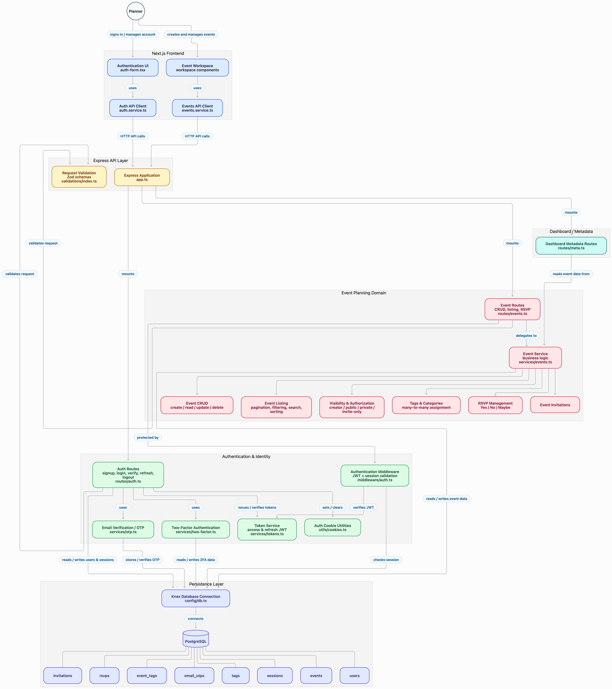

# Event Planner

Separate `backend/` (Express + Knex + Postgres) and `frontend/` (Next.js) app.

## Engineering decisions

1. **Split API and UI** — REST API is independently demoable (Swagger); Next.js calls it directly (`NEXT_PUBLIC_API_URL` + CORS + `withCredentials`).
2. **Knex + Postgres** — One squashable `db/migrations/*_initial.cjs` holds the current schema.
3. **Stateless access + refresh JWTs in HttpOnly cookies** — Short-lived access (~15m) and longer refresh (~7d) are verified by signature and expiry only. Claims carry `sub` / name / email; logout clears cookies.
4. **Email OTP (10 min) + optional TOTP 2FA** — Optional advanced auth from the brief; login 2FA returns HTTP 200 `{ requires2FA, userId }`.
5. **`visibleEvents` helper** — One place for public / creator / invite authorization used by list, detail, and dashboard.
6. **Normalized tags (M2M) + invitations table** — Clean filtering; invite-only is a deliberate extension of public/private.
7. **Zustand list/dashboard cache** — Soft navigation does not skeleton-flash; invalidate after mutations.
8. **Zod on both sides** — Same rules for create/edit/auth.

## Setup

```sh
# backend
cd backend
cp .env.example .env   # set JWT_SECRET and JWT_REFRESH_SECRET (≥32 chars)
npm install
npm run db:up
npm run db:migrate
npm run dev            # http://localhost:9000

# frontend
cd frontend
cp .env.example .env   # NEXT_PUBLIC_API_URL=http://localhost:9000
npm install
npm run dev            # http://localhost:3000
```

Backend `.env` must include `CORS_ALLOWED_ORIGINS=http://localhost:3000` (comma-separated). Cookies are HttpOnly on `localhost` (port-agnostic), so the browser sends them to `:PORT` and Next middleware can still see them on `:3000`.

- Swagger: http://localhost:9000/api/docs  
- Tests: `cd backend && npm test`  
- Signup OTP is logged in the backend terminal; non-prod UI may show **Test OTP**.

Compose reads `DB_USERNAME`, `DB_PASSWORD`, `DB_NAME`, `DB_PORT` from `backend/.env`.

## Assumptions

1. Invitees already have accounts (no outbound invite email product).
2. Postgres is an acceptable relational DB (brief allows any RDBMS).
3. Next.js App Router is acceptable as the React + TypeScript frontend.
4. Event datetimes in the UI use Nepal offset (`+05:45`).
5. “Popularity” sort from the brief is not implemented; we sort by date or created time.

<!--  -->
